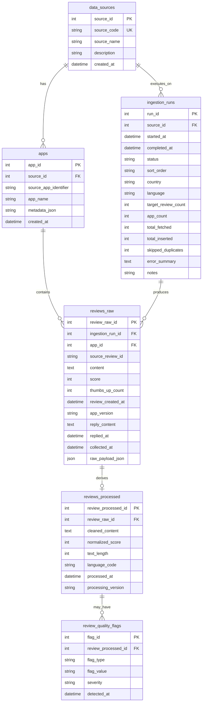

```mermaid
erDiagram
    data_sources ||--o{ apps : "has"
    data_sources ||--o{ ingestion_runs : "executes_on"
    apps ||--o{ reviews_raw : "contains"
    ingestion_runs ||--o{ reviews_raw : "produces"
    reviews_raw ||--o| reviews_processed : "derives"
    reviews_processed ||--o{ review_quality_flags : "may_have"

    data_sources {
        int source_id PK
        string source_code UK
        string source_name
        string description
        datetime created_at
    }

    apps {
        int app_id PK
        int source_id FK
        string source_app_identifier
        string app_name
        string metadata_json
        datetime created_at
    }

    ingestion_runs {
        int run_id PK
        int source_id FK
        datetime started_at
        datetime completed_at
        string status
        string sort_order
        string country
        string language
        int target_review_count
        int app_count
        int total_fetched
        int total_inserted
        int skipped_duplicates
        text error_summary
        string notes
    }

    reviews_raw {
        int review_raw_id PK
        int ingestion_run_id FK
        int app_id FK
        string source_review_id
        text content
        int score
        int thumbs_up_count
        datetime review_created_at
        string app_version
        text reply_content
        datetime replied_at
        datetime collected_at
        json raw_payload_json
    }

    reviews_processed {
        int review_processed_id PK
        int review_raw_id FK
        text cleaned_content
        int normalized_score
        int text_length
        string language_code
        datetime processed_at
        string processing_version
    }

    review_quality_flags {
        int flag_id PK
        int review_processed_id FK
        string flag_type
        string flag_value
        string severity
        datetime detected_at
    }
```

Composite unique constraints (not shown as single-column `UK` in Mermaid):

- `apps`: `UNIQUE (source_id, source_app_identifier)`
- `reviews_raw`: `UNIQUE (app_id, source_review_id)`
